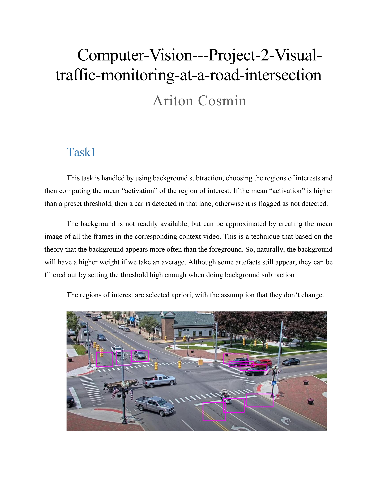
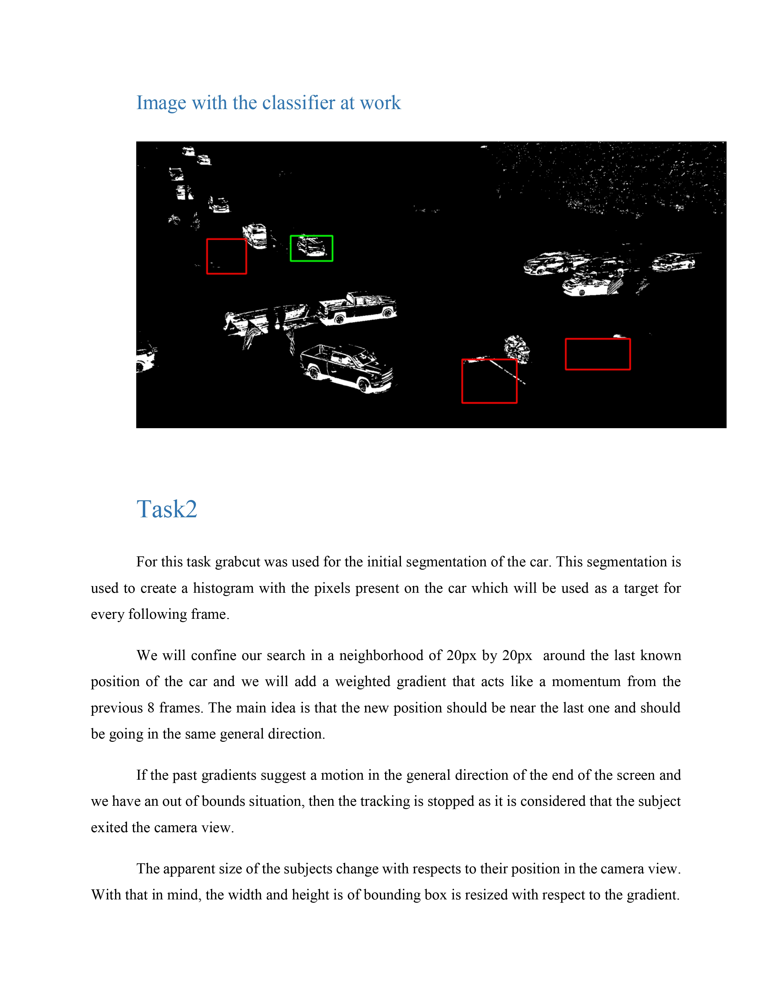
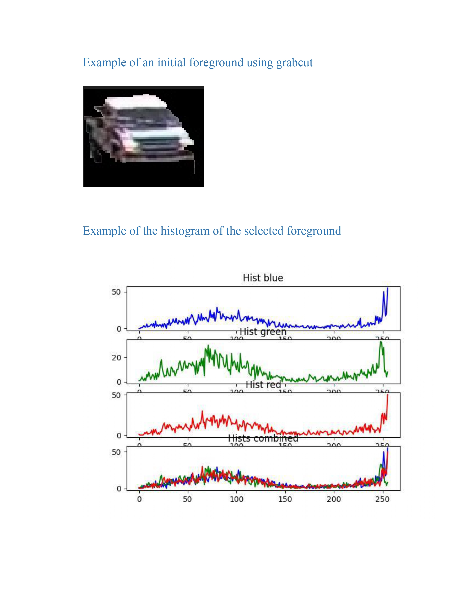

[Link to pdf with results](Ariton_Cosmin_506.pdf)

1. the libraries required to run the project including the full version of each library

python 3.10.10 was used
All the libraries required are in "requirement.txt" file. They are not here to prevent inconsitencies!

2. how to run your solution and where to look for the output file.

script: main.py
All files should be the same format as the ones provided for training(including file extentions).
"test" directory should contain "context_videos_all_tasks" as "train" directory did
"ROOT_DIR" variable will be changed as needed to point to the corect input directory. It will most likely be "test" and it is expected to have the same structure as "train".

function main() to run Task1 and Task2
Task3 solution is not provided

Output will be "Ariton_Cosmin_506" in the root directory.
Subdirectories of "Ariton_Cosmin_506" will be "Task1" and "Task2" with the solutions for the respective task
